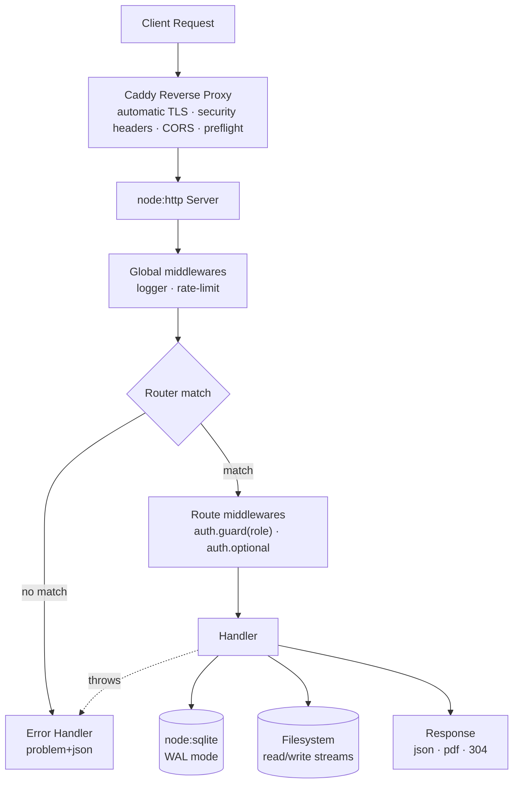

# LMS API

> A Learning Management System REST API built **from scratch on top of Node.js native modules** — no Express, no Fastify, no NestJS. Just `node:http`, engineering decisions, and a hand-rolled web framework.


---

## ✨ Highlights

- **Zero web-framework dependencies** — routing, middleware pipeline, body parsing, error handling and cookies implemented on raw `node:http` (the only runtime dependency is `jspdf`, used to render certificate PDFs)
- **Session-based authentication** — opaque session IDs generated with `crypto.randomBytes`, stored **only as SHA-256 hashes**, delivered via hardened cookies (`__Secure-` prefix, `HttpOnly`, `Secure`, `SameSite=Lax`) with sliding expiration
- **Hardened password storage** — HMAC-SHA256 pepper → **scrypt** (N=2¹⁴, r=8, p=1) with per-user salts, Unicode NFC normalization, self-describing hash format and `timingSafeEqual` comparison
- **RBAC authorization** — hierarchical roles (`admin` › `editor` › `user`) enforced by composable `auth.guard(role)` middleware
- **Rate limiting** — per-IP fixed-window limiter emitting the standard IETF `RateLimit` / `RateLimit-Policy` / `Retry-After` headers
- **Streaming uploads** — raw `application/octet-stream` bodies piped through a custom `Transform` byte-cap straight to disk, finalized with an **atomic rename**
- **HTTP caching** — weak `ETag` + `If-None-Match` handling with `304 Not Modified` short-circuits
- **Private file delivery** — `X-Accel-Redirect` pattern: Node authorizes, Caddy serves bytes off the event loop
- **RFC 9457-style errors** — every failure returns `application/problem+json` through a single centralized error handler
- **Production topology** — multi-stage Docker build + Caddy with automatic HTTPS, HSTS, CSP, COOP/COEP/CORP and OWASP secure-header cheat-sheet compliance

## 🏗️ Architecture



Every feature module extends an abstract `Api` class that receives typed references to the **router** and **database** — a lightweight composition-root pattern that keeps modules decoupled and pluggable (`new AuthApi(core).init()`):

```
src/
├── index.ts                  # Composition root: wires modules, global middlewares, graceful shutdown
├── env.ts                    # Typed environment configuration
├── core/                     # ← the framework itself
│   ├── core.ts               #   HTTP server, request lifecycle, centralized error handler
│   ├── router.ts             #   All 9 HTTP methods, :params matching, typed [...middlewares, handler] chain
│   ├── database.ts           #   node:sqlite wrapper: PRAGMA tuning + prepared-statement cache
│   ├── http/
│   │   ├── custom-request.ts #   Enriches IncomingMessage: query, params, cookies, session, ip
│   │   └── custom-response.ts#   status()/json()/setCookie() fluent helpers
│   ├── middleware/
│   │   ├── body-json.ts      #   Streaming JSON parser with Content-Length + incremental size caps
│   │   ├── rate-limit.ts     #   Fixed-window limiter (IETF RateLimit fields headers)
│   │   └── logger.ts
│   └── utils/
│       ├── errors.ts         #   HTTP error classes with toJSON() (problem+json)
│       ├── validate.ts       #   Sanitizers/validators: string, number, email, cpf, password, file…
│       └── abstract.ts       #   CoreProvider / Api / Query base classes (dependency management)
└── api/
    ├── auth/                 # Users, sessions, password flows, RBAC guards
    │   ├── query.ts          #   Parameterized SQL (prepared statements)
    │   ├── services/session.ts   # Session creation, sliding validation, revocation, reset tokens
    │   ├── middleware/auth.ts    # guard(role) + optional middlewares
    │   ├── utils/password.ts #   scrypt + HMAC pepper hashing engine
    │   └── tables.ts         #   STRICT schema: users, sessions, resets
    ├── lms/                  # Courses, lessons, progress tracking, PDF certificates
    │   ├── query.ts          #   Window functions, JOINs, views-backed queries
    │   ├── utils/certificate.ts  # jsPDF certificate renderer
    │   └── tables.ts         #   STRICT schema: courses, lessons, lessons_completed, certificates (+ views)
    └── files/                # Stream-based uploads & delivery
        ├── utils.ts          #   LimitBytes Transform, ETag helpers, vipsthumbnail image cropping
        └── index.ts          #   public/private/upload handlers
```

## 🧩 Built on Node.js Native Modules

| Module | Where it shines |
| --- | --- |
| `node:http` | Server bootstrap, request/response lifecycle |
| `node:crypto` | `randomBytes`, `scrypt`, `createHmac`, `createHash`, `timingSafeEqual`, `randomUUID` |
| `node:sqlite` | Synchronous embedded database with prepared statements |
| `node:stream` | Body parsing, upload pipelines, custom `LimitBytes` Transform, `pipeline()` |
| `node:fs/promises` | Atomic `rename`, temp cleanup, `stat` for ETags |
| `node:child_process` | `vipsthumbnail` spawned for server-side image cropping |
| `node:util` | `promisify` for async crypto primitives |

## 📦 Feature Modules

### 🔐 Auth
- User registration with uniqueness checks (email + username) → `201` / `409 Conflict`
- Login issuing opaque session cookies bound to IP + User-Agent metadata
- Session validation with **sliding expiration** (15-day TTL, refreshed within the final 5 days)
- Logout (single session) and **global invalidation** on password change
- Forgot / reset password flow with single-use, 30-minute expiring tokens (stored hashed)
- Admin-only paginated user search (`LIKE` search + `X-Total-Count` pagination header)

### 🎓 LMS
- Course & lesson CRUD restricted to `admin` role
- Public catalog endpoints; lesson detail enriches `prev`/`next` navigation via a SQL view
- Lesson completion tracking with composite primary keys (`WITHOUT ROWID`)
- Automatic **certificate issuance** when a course reaches 100% completion
- On-demand **PDF certificate rendering** served as `application/pdf`

### 📁 Files
- Raw-stream uploads capped at **150 MB** — rejected mid-flight by a `Transform` stream, never buffered in memory
- Temp-file + `wx` flag + **atomic rename** pattern (no partially-written files are ever visible)
- Public files served with `ETag`, `Last-Modified`, `Content-Type` mapping and `304` revalidation
- Private files gated behind auth, delegated to Caddy via `X-Accel-Redirect`

## 🛡️ Security

| Threat | Mitigation |
| --- | --- |
| Password DB leak | HMAC-SHA256 **pepper** applied before scrypt (injected via the `PASSWORD_PEPPER` env variable); hashes useless without the app secret |
| Timing attacks | `crypto.timingSafeEqual` for hash comparison |
| Session theft via DB read | Only SHA-256 hashes of session IDs persisted — raw IDs never stored |
| XSS-stealed cookies | `HttpOnly` + `Secure` + `__Secure-` prefix + `SameSite=Lax` (also mitigates CSRF) |
| Brute force / abuse | Per-IP rate limiting on login, registration and reset endpoints (standard `RateLimit` headers) |
| Path traversal | Strict filename regex `[A-Za-z0-9._-]+`, rejects dot-prefixed names |
| DoS via large payloads | Dual-layer caps: `Content-Length` check + incremental byte counting while streaming |
| Cache leaking private data | `Cache-Control: private, no-store` + `Vary: Cookie` on authenticated responses |
| Protocol-level attacks | OWASP Secure Headers via Caddy: HSTS, CSP, COOP, COEP, CORP, `nosniff`, `Permissions-Policy` |
| Unvalidated input | Dedicated validator library — every handler sanitizes before touching the DB |
| SQL injection | 100% parameterized statements through cached prepared statements |
| Zombie connections | Graceful shutdown (`SIGINT`/`SIGTERM`) drains connections, closes DB, force-exits after 5 s |

## 🔌 API Reference

Base URL: `https://<SERVER_NAME>/api` (Caddy strips the `/api` prefix before proxying to Node).

### Auth

| Method | Route | Access | Description |
| --- | --- | --- | --- |
| `POST` | `/auth/user` | Public* | Register user |
| `POST` | `/auth/login` | Public* | Authenticate, sets session cookie |
| `GET` | `/auth/session` | `user`+ | Check current session validity and role |
| `DELETE` | `/auth/logout` | `user`+ | Revoke current session |
| `PUT` | `/auth/password/update` | `user`+ | Change password (revokes all other sessions) |
| `POST` | `/auth/password/forgot` | Public* | Issues single-use reset token |
| `POST` | `/auth/password/reset` | Public* | Resets password with token |
| `GET` | `/auth/users/search?s=&page=` | `admin` | Paginated user search |

### LMS

| Method | Route | Access | Description |
| --- | --- | --- | --- |
| `POST` | `/lms/course` | `admin` | Create course |
| `DELETE` | `/lms/course/:id` | `admin` | Delete course |
| `GET` | `/lms/courses` | Public | List all courses |
| `GET` | `/lms/course/:slug` | Optional auth | Course detail + lessons + viewer progress |
| `GET` | `/lms/lessons` | `admin` | List all lessons |
| `POST` | `/lms/lesson` | `admin` | Create lesson |
| `DELETE` | `/lms/lesson/:id` | `admin` | Delete lesson |
| `GET` | `/lms/lesson/:courseSlug/:lessonSlug` | Optional auth | Lesson detail + prev/next nav + completion |
| `POST` | `/lms/lesson/complete` | `user`+ | Mark lesson complete (issues certificate at 100%) |
| `DELETE` | `/lms/course/reset` | `user`+ | Reset own progress in a course |
| `GET` | `/lms/certificates` | `user`+ | List viewer's certificates |
| `GET` | `/lms/certificate/:id` | Public | Download certificate as PDF |

### Files

| Method | Route | Access | Description |
| --- | --- | --- | --- |
| `POST` | `/files/upload` | octet-stream | Streamed upload (`x-filename`, `x-visibility` headers) |
| `GET` | `/files/public/:name` | Public | Serve public file (ETag / 304 aware) |
| `GET` | `/files/private/:name` | `user`+ | Authorized delivery via `X-Accel-Redirect` |

\* Tight per-IP rate limits apply (e.g. 5 logins per 30 s).
\+ Role hierarchy: `admin` satisfies any guard; `editor` satisfies `editor`/`user`.

> **Note:** in production, `/files/public/*` is served directly by Caddy's static file server (zero app overhead) and private downloads are authorized by Node, then delivered by Caddy via `X-Accel-Redirect` interception.

## 🚀 Getting Started

Requirements: [Docker](https://docs.docker.com/compose/) (or Node.js 24+ and `vips-tools` for bare-metal runs).

1. Configure environment (see `src/env.ts` for all keys):

   ```env
   SERVER_NAME=localhost
   FROM_EMAIL=email@example.com
   DB_PATH=/db/db.sqlite
   FILES_PATH=/files
   PASSWORD_PEPPER=change-me-in-production
   ```

   > **Warning:** the pepper is mixed into every password hash (HMAC before scrypt). Changing `PASSWORD_PEPPER` after users are registered invalidates **all** stored hashes — nobody can log in until passwords are reset.

2. Start the full stack (Node API + Caddy):

   ```bash
   docker compose up --build
   ```

3. Exercise the API with the bundled smoke-test client:

   ```bash
   node client.js getCourses
   ```

### npm scripts (bare metal)

| Script | Command | Purpose |
| --- | --- | --- |
| `dev` | `tsx --watch src/index.ts` | Hot-reload development |
| `build` | `tsc` | Compile to `dist/` (ESM, NodeNext) |
| `start` | `node dist/index.js` | Run production build |

## ⚙️ Engineering Decisions

- **STRICT tables + `WITHOUT ROWID`** — type-enforced columns and clustered primary keys for leaner storage on join-heavy tables.
- **Prepared-statement cache** — SQL strings are compiled once per process and reused, eliminating parse overhead on hot paths.
- **WAL journal mode** — readers never block the writer; paired with `busy_timeout` and `foreign_keys` pragmas.
- **Self-describing password hashes** (`scrypt$v=1$norm=NFC$N=…`) — algorithm parameters travel inside the hash, enabling painless future cost upgrades.
- **Atomic uploads** — bytes stream to a UUID temp file opened with exclusive `wx` flag, then `rename()` publishes it atomically; failures clean up in `finally`.
- **Standard rate-limit headers** — clients can introspect `RateLimit`, `RateLimit-Policy` and `Retry-After` instead of guessing.
- **Timers with `unref()`** — housekeeping intervals (session GC, rate-limit eviction) never prevent process shutdown.
- **Multi-stage Docker build** — dev dependencies never ship in the production image; volumes isolate database and file state.
- **Reverse-proxy file serving** — Node performs authorization and hands off delivery to Caddy (`X-Accel-Redirect`), keeping large-file I/O off the JavaScript event loop.
